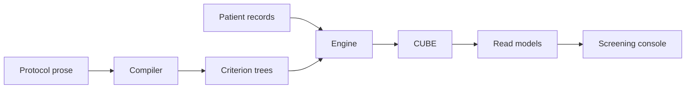
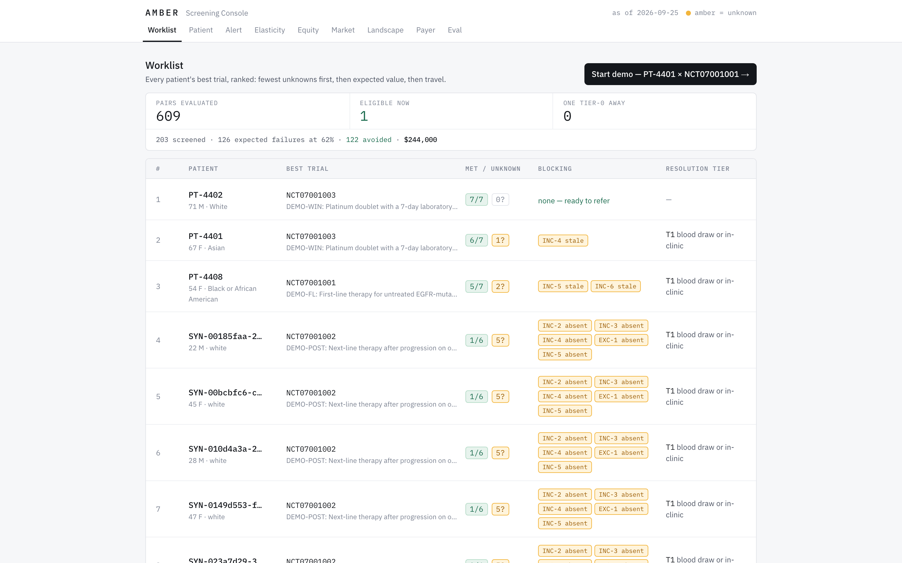
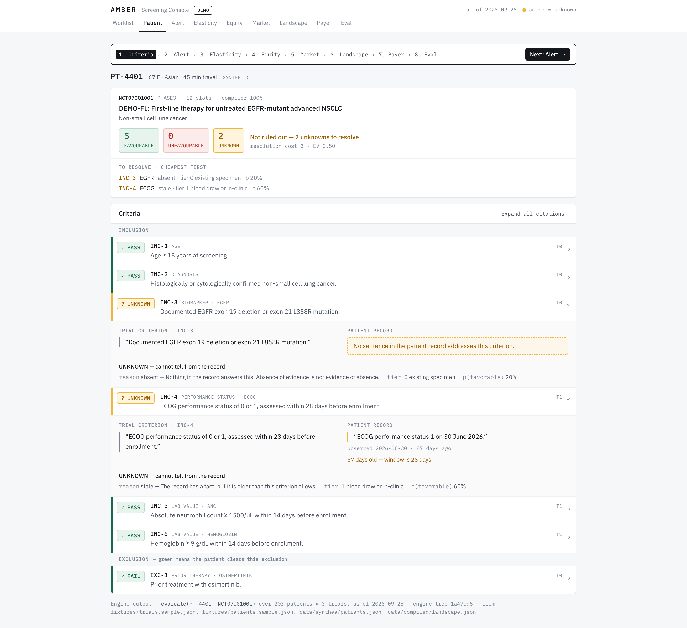
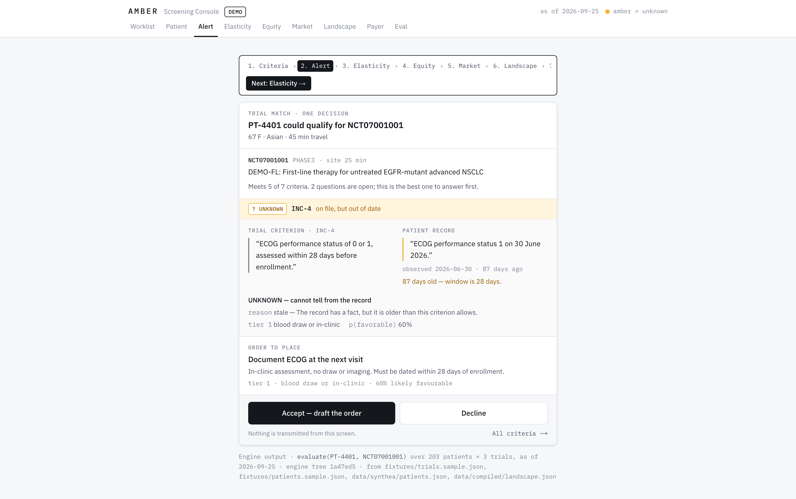
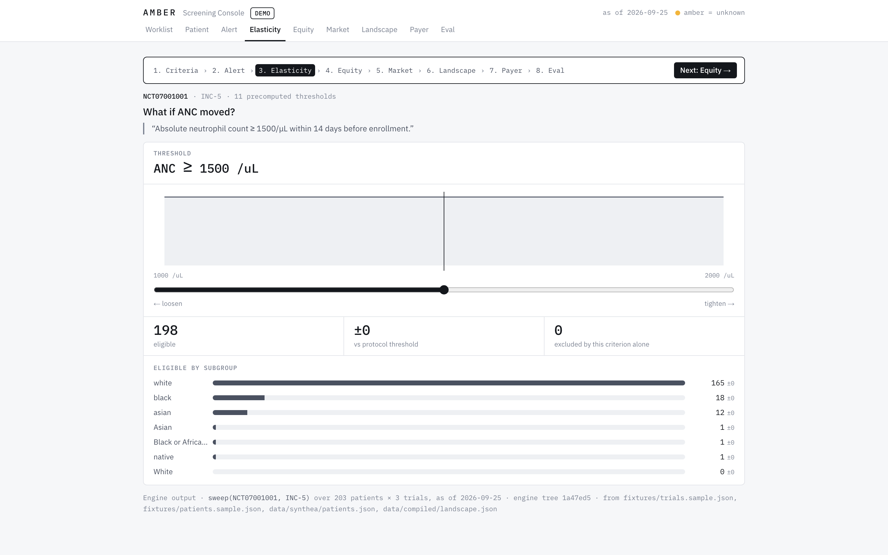
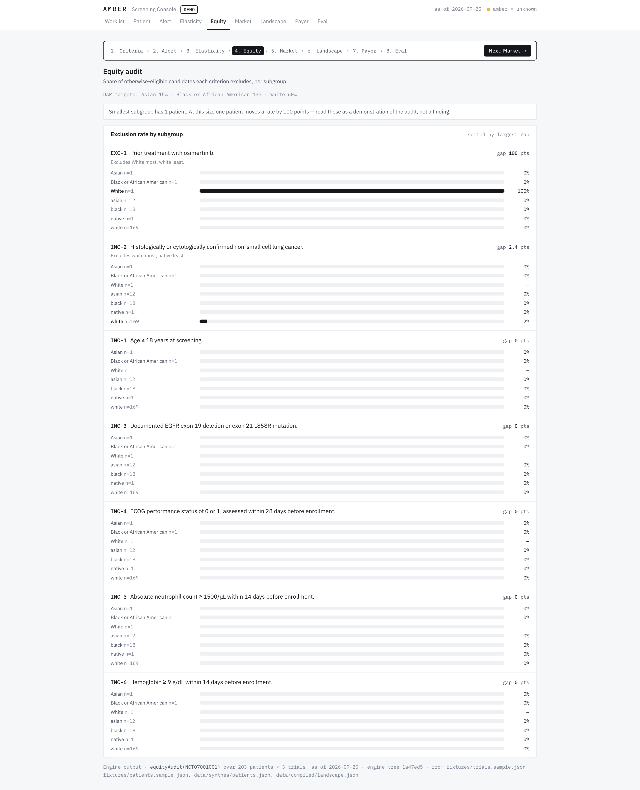
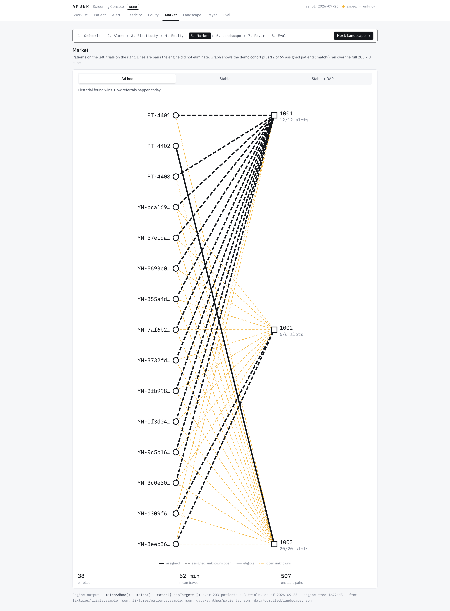

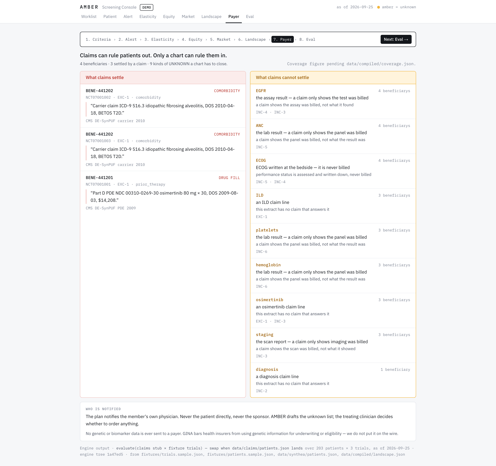
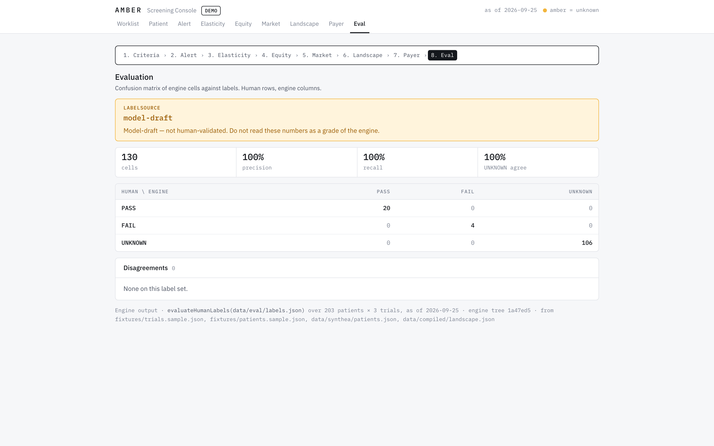

# Amber

A screening console for clinical-trial eligibility. It does not answer “eligible / not eligible.” It answers **what is missing**, **what to order next**, and **who at this site goes where** when several trials compete for the same patients.

The compiler turns protocol prose into executable criterion trees. The engine scores every patient × trial × criterion with three-valued logic — PASS / FAIL / UNKNOWN — in deterministic code. No model inference sits on the scoring path. The cube of those cells is the only thing the UI reads.

## Absence is not a no

Most trial-matching systems treat a missing fact as a failed criterion. That is negation-as-failure, and it over-rejects: a chart that never mentioned EGFR is not a chart that proved the patient EGFR-negative. Amber keeps a third value. Absent fact → UNKNOWN. Stale beyond `maxAgeDays` → UNKNOWN. Never FAIL. Amber, in this product, means UNKNOWN and nothing else.

Every UNKNOWN is priced (tier 0 specimen already in the fridge through tier 4, which only time can buy) and cited twice: the trial’s own words and the sentence from the record, or the honest line that no sentence addresses the criterion. The worklist ranks “cheapest first.” Elasticity asks what happens if a threshold moves. Equity asks who a criterion excludes. The market assigns patients to competing slots with deferred acceptance. Claims data can rule a patient out; only a chart can rule them in.

## Architecture



- **Compiler** (`src/compiler`) extracts trees from ClinicalTrials.gov eligibility text. A tree that fails validation is flagged `needsHumanReview` and leaves the demo pool.
- **Engine** (`src/engine`) is pure: no fetch, no filesystem, no `Date.now()` — `asOf` is passed in. `evaluate` writes the cube; `sweep`, `equityAudit`, `match`, and `evaluateHumanLabels` are the other entry points.
- **CUBE** is every `(patient, trial, criterion)` cell: verdict, reason, dual citations, tier, `pFavorable`.
- **Read models** (`app/_data/generate.ts`) precompute the worklist, elasticity sweep, equity bars, market assignment, landscape histogram, payer split, and eval matrix. The app never re-runs the engine on a slider drag.

Shared types live in `src/contracts`. Lanes do not import across folders.

## Run it

```bash
npm install
npm run dev
```

Open [http://localhost:3000](http://localhost:3000). `/?demo=1` walks the presentation path (PT-4401 × NCT07001001) through criteria, alert, elasticity, equity, market, landscape, payer, and eval.

```bash
npm test                                          # engine
npx vitest run --config components/vitest.config.ts
npx vite-node --config vitest.config.ts app/_data/generate.ts
npx playwright install chromium                   # once
npm run shots                                     # docs/shots/ — 1440 and 390, light and dark
```

`npm run shots` reuses a running `next dev` if one is already up (Next 16 allows one per repo). Set `SHOTS_BASE` to point at a specific origin.

## What is synthetic

Nothing on screen is a real patient. Do not present it as one.

| Source | What it is |
|---|---|
| `fixtures/trials.sample.json`, `fixtures/patients.sample.json` | Hand-written 3 × 3 so the hero pair has exactly two unknowns. |
| `data/synthea/patients.json` | 200 synthetic adults from public Synthea extracts. Race, labs, and travel time are documented in `data/POPULATION.md`. |
| Open-access PMC case reports | Narrative text for the extractor. Structured facts are not LLM-authored, then scored — that loop would invalidate the evaluation. |
| Payer stub | Four DE-SynPUF-shaped `BENE-*` records until `data/claims/patients.json` lands. |
| `/eval` labels | `labeller: model-draft`. The 100% diagonal is expected and is **not** a human grade. The page says so first. |

The landscape histogram is compiled from 300 public trial records. The cube the rest of the console shows is the fixture trio evaluated against the Synthea cohort (203 × 3) until accepted compiled trees replace the empty `needsHumanReview` set.

## Prior art

Trial matching is not an empty field. [docs/PRIOR-ART.md](docs/PRIOR-ART.md) names Trial Pathfinder (*Nature* 2021), MatchMiner (Dana-Farber), Dameron’s 2013 three-valued OWL model, IBM’s cost-vector patent, federated feasibility networks, and the ASCO–Friends / JCO equity analyses.

Those systems optimise for classifying eligibility, which the chart usually cannot answer. We optimise for the next action. When several trials at one site compete for the same patients, we clear the market with deferred acceptance — the algorithm that matches residents to hospitals. We have not seen that last part pointed at enrolment. Verify every citation in PRIOR-ART before it goes on a slide.

## Screens

Every route at 1440×900 and 390×844, light and dark, is in [`docs/shots/`](docs/shots/). These are the desktop-light frames.

| | |
|---|---|
| **Worklist** — cheapest unknowns first; screen-failures-avoided on the strip | **Criteria** — dual citations, amber = UNKNOWN |
| [](docs/shots/worklist-1440-light.png) | [](docs/shots/patient-1440-light.png) |
| **Alert** — one order, one reason | **Elasticity** — precomputed sweep, no recompute on drag |
| [](docs/shots/alert-1440-light.png) | [](docs/shots/elasticity-1440-light.png) |
| **Equity** — who a criterion excludes | **Market** — deferred acceptance across competing slots |
| [](docs/shots/equity-1440-light.png) | [](docs/shots/market-1440-light.png) |
| **Landscape** — threshold histogram over the compiled corpus | **Payer** — claims rule out; only a chart rules in |
| [](docs/shots/landscape-1440-light.png) | [](docs/shots/payer-1440-light.png) |

**Eval** — confusion matrix, `labelSource` first, never sold as human-validated:

[](docs/shots/eval-1440-light.png)

Mobile and dark counterparts use the same names with `-390-` / `-dark`.

Build contract: [docs/CONTRACT.md](docs/CONTRACT.md).
